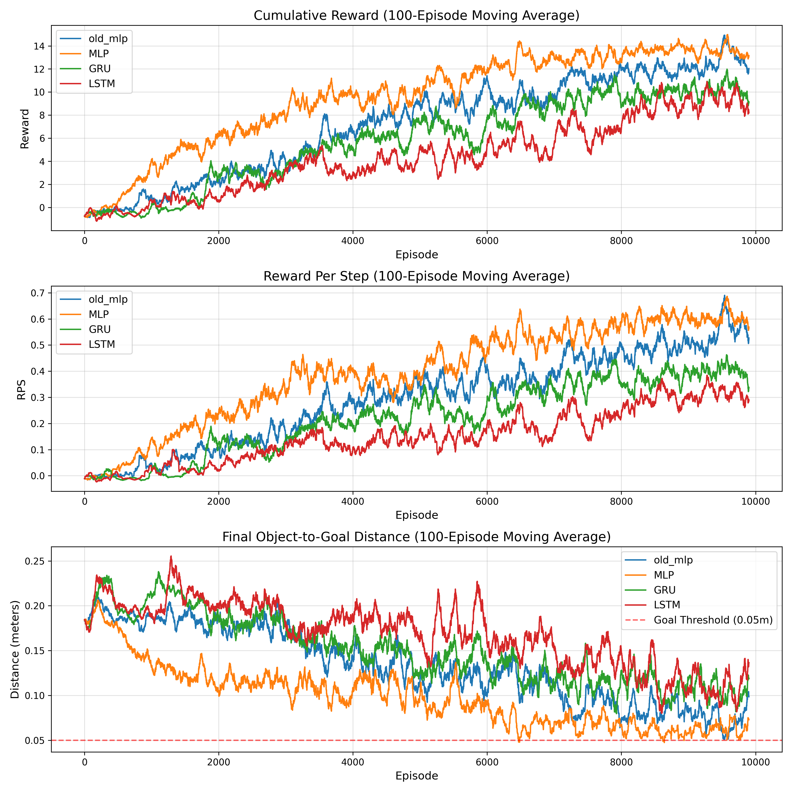

# Deep Learning in Robotics: Temporal Memory and Reward Shaping

This repository contains the code and final report for a Deep Reinforcement Learning project focusing on a robotic manipulation task (tabletop object pushing) simulated in MuJoCo. 

The project investigates whether erratic agent behavior stems from a lack of temporal memory in a Partially Observable Markov Decision Process (POMDP) or from flawed reward functions leading to local optima. It compares reactive baselines, finite-memory frame stacking (MLP), and infinite-memory Deep Recurrent Q-Networks (DRQN with GRU/LSTM).

## Key Highlights
* **Environment Engineering:** Fixed a critical "hovering" exploit caused by an inverse-distance reward function by implementing **potential-based progress shaping**.
* **Custom Episodic Memory:** Implemented an `EpisodicReplayBuffer` to store and sample complete, synchronized trajectories rather than randomized transitions.
* **Truncated BPTT with Burn-in:** Solved the "stale hidden state" problem in off-policy RNN training by utilizing a 10-step burn-in sequence to initialize hidden states before applying backpropagation to a 20-step learning chunk.
* **Curriculum Learning:** Utilized dynamic object-spawn distances to ramp up task difficulty and encourage early exploration.

## Results & Training Metrics

The task was evaluated over 10,000 episodes across four architectures. The results demonstrated that while the task lacked velocity/momentum data, it was fundamentally a **quasi-static** environment. Frame stacking (MLP) achieved the highest success rate with stable optimization, whereas complex RNN architectures overcomplicated the learning process.


*(Note: Success is defined as pushing the object within a 0.05m threshold of the goal).*

## 📂 Project Structure

```text
.
├── drqn_env.py                  # The MuJoCo environment, state normalization, and reward logic
├── train_mlp.py                 # Training script for 1-State and 4-State (Frame Stacking) DDQN
├── train_drqn.py                # Training script for DRQN (GRU and LSTM)
├── train_old_mlp.py             # Training script for the old MLP (1 state)
├── test_dqn.py                  # Script to evaluate trained models via mujoco rendering
├── compare_models.py # Script to generate the comparative metric plots
├── utils.py                     # Helper functions (seed setting, etc.)
├── assets/                      # Directory for saved plots and visuals
└── runs/                        # Auto-generated directory containing saved models, logs, and metrics
